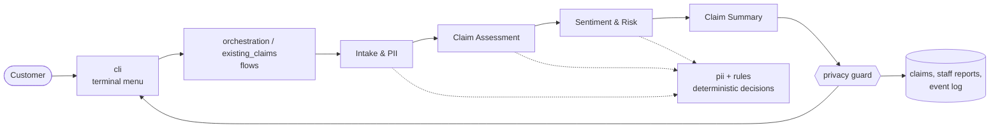

# Northstar Auto Insurance: Claim Support

A terminal customer-support app for car insurance claims, built with four cooperating AI agents
and deterministic rules. Customers describe things in their own words. The system removes their
personal information, understands the claim, reads urgency and sentiment, and routes the claim to
the right human team with a real follow-up date.

Northstar Auto Insurance is fictional, and so is every name, number, and claim in this repository.



The full diagrams are in [docs/architecture.md](docs/architecture.md).

## What it does

| Menu option | What happens |
|---|---|
| **1. File a new claim** | The customer describes the incident. They get a claim number, a summary of what was recorded, which team will contact them and by when, and a list of any missing details. Staff get a markdown report. |
| **2. Check my claim status** | Enter a claim number like `CLM-2026-0005` (upper or lower case) to see the status, what's still needed, and the next follow-up date. There are no model calls. |
| **3. Add or correct details** | Add missing details or correct earlier ones. Additions apply right away. Corrections to sensitive facts (incident type, injuries, whether another party was involved) are held until an adjuster confirms them. |
| **4. Get help with my claim** | Complaints, delays, claim questions, or asking for an adjuster. The request is routed to the right team with a follow-up date, even without a claim number. |

Follow-ups are promised in 1–3 business days depending on urgency: 1 for injuries and escalations,
2 for standard claims, and 3 for contact changes and privacy reviews. Dates skip weekends.

## What it doesn't do

- It never decides fault or coverage, approves or denies a claim, gives legal advice, or alleges
  fraud. Replies are checked for decision language before anyone sees them.
- It doesn't handle billing, policy changes, rental cars, towing, or roadside help. Under **Get
  help**, those requests are politely redirected.
- It has no login or policy lookup, and it stores data in local files, not a database.

## Safety guarantees

- **Personal information is removed before any agent reasons about the text.** Regex and validators
  run first. Then the model suggests names and bare plates, which are applied only if they appear
  word for word. A final re-scan checks the result. If anything is still found, the claim goes to
  a human privacy review with no facts saved.
- **Nothing personal is stored, logged, or shown back.** A final privacy guard checks every reply,
  report, and record before it's written. The event log holds structured fields only.
- **Code decides, models assist.** Missing information, risk level, escalation, team routing, and
  dates are deterministic rules. The models only classify, extract, read sentiment, and write short
  text.
- **Customer text is data, never instructions.** Prompt-injection attempts are flagged for Special
  Review and never obeyed. Sentiment can add a Customer Relations follow-up, but it never raises
  risk.
- **Failures are safe.** Model errors are retried, then recorded as status-only reports without the
  narrative. Unexpected bugs, end of input, and Ctrl+C never show a traceback or leave a
  half-saved claim.

## Setup

You need [uv](https://docs.astral.sh/uv/) and an [OpenRouter](https://openrouter.ai/) API key.

```bash
git clone https://github.com/bashirali13/insurance_claim_support_system.git
cd insurance_claim_support_system
uv sync
cp .env.example .env    # then edit .env
```

Fill in `.env` (it's gitignored, so never commit it):

```bash
OPENROUTER_API_KEY="your_openrouter_api_key"
MODEL_NAME="deepseek/deepseek-v4-flash-0731"
```

`MODEL_NAME` is any OpenRouter model name in `provider/model` form. The project was developed and
evaluated with the DeepSeek model above.

## Running

```bash
uv run claim-support                  # start the menu
uv run claim-support --load-samples   # also load six sample claims, CLM-2026-0001 to 0006
uv run claim-support --trace          # show a sanitized staff trace after each reply
```

Type or paste your description, then press Enter on an empty line to send it. Choose option 5 to
exit.

A quick tour: start with `--load-samples`, choose **2** and enter `CLM-2026-0005`, then choose
**1** and describe a fender-bender. Your claim is saved in `data/claims/`, and the staff report is
in `output/`.

What the customer and staff see is shown in [docs/samples/](docs/samples/), captured from real model
runs. For example, see [a routine filing](docs/samples/filing-s01-routine.md) and
[an escalated filing](docs/samples/filing-s10-escalation.md).

## Testing

```bash
uv run pytest            # full suite: fixed fixtures and scripted models, no network
uv run pytest -m live    # live evaluation against the real model (needs .env)
uv run pytest -k ac_2_3  # the tests for one acceptance criterion
uv run ruff check .      # lint
```

Every test is named after the acceptance criterion it covers, like
`test_ac_11_1_filing_scenario_is_customer_safe_and_routed`. Unit tests use PydanticAI's
`TestModel` and `FunctionModel`, so they're fast and deterministic. The live tests measure PII
removal, classification accuracy, and adversarial safety against the real model.

## Project structure

```text
src/claim_intake/
  cli.py              terminal menu, input limits, error boundary, --trace
  orchestration.py    "File a new claim" flow, step logging, failure handling
  existing_claims.py  status, add/correct details, and get-help flows
  agents/             intake.py, assessment.py, risk.py, summary.py (+ shared prompting/validation)
  pii.py              regex and validator PII detection and placeholders
  rules.py            deterministic decisions: missing info, risk, routing, fact diffs, status
  reporting.py        customer replies, staff reports, and the trace
  storage.py          claim, help, report, and event-log files
  contracts.py        every handoff type (frozen Pydantic models, enums)
  config.py, dates.py settings from .env, business-day arithmetic
data/samples/         six fictional sample claims
tests/                unit/, integration/, live/, fixtures/
specs/                one folder per phase: spec, plan, tasks, contracts
docs/                 outline, UX walkthrough, scenarios, architecture, samples, prompt history
```

## How it was built

This project follows **spec-driven development** with strict **test-driven development**, using
[SpecKit](https://github.com/github/spec-kit):

1. Each phase starts with a spec whose acceptance criteria have IDs (`AC-2.3`). It is clarified,
   planned, and broken into tasks, then analyzed for gaps before any code is written.
2. Tests are written only from acceptance criteria, and code only to make a failing test pass.
   Commits follow the rhythm `test:` → `feat:` → `refactor:`.
3. Each phase is one branch and one pull request, merged when the suite is green.

| Phase | What it delivered |
|---|---|
| [000 Foundation](docs/prompt-history/01-kickoff-and-constitution.md) | Constitution, tooling, scope and UX |
| [001 File a claim](specs/001-file-a-claim/spec.md) | The four agents, PII pipeline, rules, reports |
| [002 Existing-claim support](specs/002-existing-claim-support/spec.md) | Status, add/correct details, get help |
| [003 Hardening and release](specs/003-hardening-and-release/spec.md) | Error boundary, trace mode, adversarial suite, docs |

## Further reading

- [Constitution](.specify/memory/constitution.md): the governing rules
- [Project outline](docs/project-outline.md): scope and background
- [User experience walkthrough](docs/user-experience.md): every screen and message
- [Customer scenarios](docs/customer-scenarios.md): example inputs and expected outcomes
- [Architecture](docs/architecture.md): components and the filing sequence
- [Prompt history](docs/prompt-history/): the decisions, pushbacks, and clarifications behind
  each phase
