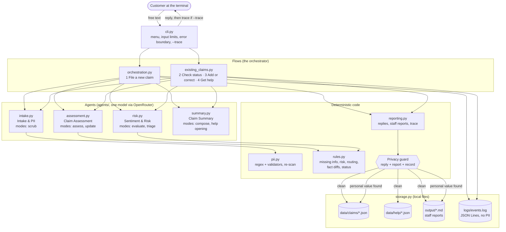
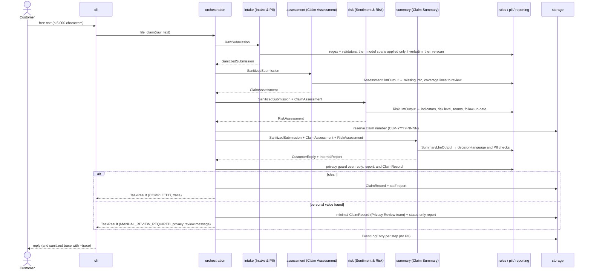

# Architecture

Northstar Auto Insurance claim support is a terminal app with one orchestrator and four agents.
Agents never call each other. The orchestrator passes frozen Pydantic contracts between them, and
deterministic code makes every decision that matters: validation, missing information, risk
level, escalation, and routing. The models only classify, extract, read sentiment, and write short
text.

The governing rules are in the [constitution](../.specify/memory/constitution.md). Module names
below are the files in [`src/claim_intake/`](../src/claim_intake/).

## Components

Option 2 (check status) reads a saved claim and makes no model calls. Supporting modules not drawn
above: `contracts.py` (every handoff type), `config.py` (`.env` settings), and `dates.py`
(business days).

## File a new claim, step by step

Each arrow carries a contract from [`contracts.py`](../src/claim_intake/contracts.py). No agent
ever sees raw text except the Intake & PII agent, and that agent sees it only after the regex pass.

## Failure handling

Every model step is retried a limited number of times. If a step still fails, the orchestrator
writes a status-only report (`FAILED_MODEL_ERROR`, `FAILED_VALIDATION`, or `FAILED_OUTPUT`) with
no narrative or facts, and releases any claim or help number it reserved. If personal information
can't be confirmed removed, either at intake or at the final privacy guard, the claim keeps its
number but is saved without any facts, marked `MANUAL_REVIEW_REQUIRED`, and routed to the Privacy
Review team.
An unexpected bug is caught at the CLI boundary: the customer sees a short apology, a
`FAILED_UNEXPECTED` status-only report is written, and the menu returns. End of input exits
cleanly with code 0, and Ctrl+C exits with code 130 without leaving a reserved number behind.
